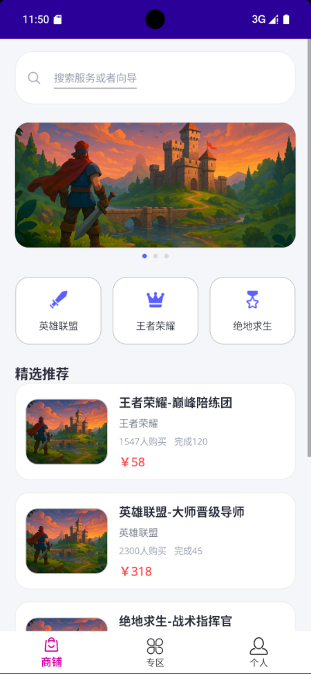
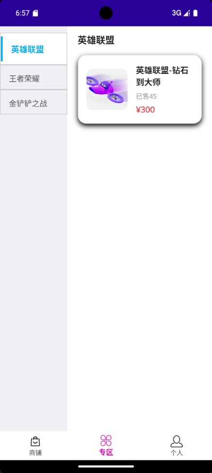
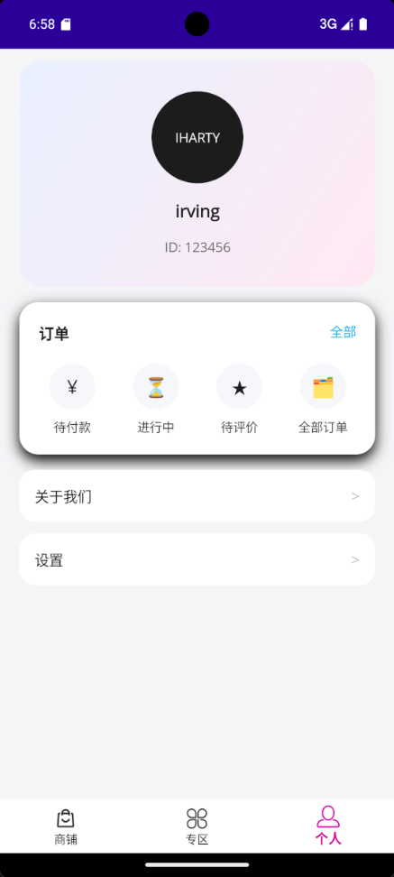

# GamerLinkApp

GamerLinkApp is a cross-platform .NET MAUI sample marketplace that connects players with curated gaming services. It ships with seeded content, MVVM patterns, and modern tab navigation so you can explore how to build premium marketplace experiences with MAUI.

## Highlights
- Cross-platform marketplace built with .NET MAUI targeting Android, iOS, macOS, and Windows from one codebase.
- Service discovery shop tab with search UI, featured carousel, and rich service cards that deep-link into detail pages.
- Game zone hub that filters services by game and spotlights one highlighted offer with pricing CTAs.
- Player profile dashboard that aggregates spend, order status counts, and metadata for a signed-in user.
- Offline-first data layer backed by EF Core and SQLite with optional mock data service for rapid iteration.

## Screenshots

| Shop tab | Zone hub | Profile dashboard |
| --- | --- | --- |
|  |  |  |

## Architecture

- `Views/` contains XAML pages for the shop, zone, profile, and service detail experiences. Each page is styled with gradients, rich cards, and modern layouts.
- `ViewModels/` implements the MVVM presentation logic with observable collections, query properties, and async data loading.
- `Services/` provides `IDataService` plus `SqliteDataService` for production and `MockDataService` for design-time or testing scenarios.
- `Data/ServiceDbContext` configures EF Core, including JSON converters for string lists (image URLs and tags).
- `Helpers/ServiceHelper` exposes the MAUI dependency injection container so navigation-created pages can request view models.
- `AppShell` wires the tab bar (shop, zone, profile) and registers the detail page route.

## Getting Started

1. Install the .NET 9 SDK and MAUI workloads:
   ```bash
   dotnet --version
   dotnet workload install maui
   ```
2. Restore dependencies and build:
   ```bash
   dotnet restore
   dotnet build
   ```
3. Run on your target platform:
   - Windows: `dotnet build -t:Run -f net9.0-windows10.0.19041.0`
   - Android emulator: `dotnet build -t:Run -f net9.0-android`
   - iOS or Mac Catalyst: open the solution in Visual Studio 2022 (17.9+) on macOS and choose the desired target.

## Data and debugging notes

- The SQLite database lives under the platform specific app data directory (`FileSystem.AppDataDirectory`). On first launch the app seeds featured services, a sample user, and recent orders.
- In `DEBUG` builds the database file is deleted on startup so you always see the seeded content while iterating. Comment out the deletion block in `MauiProgram.cs` if you want the data to persist between runs.
- Swap in `MockDataService` inside `MauiProgram` if you prefer an in-memory data source. This is useful when running unit tests or when storage is unavailable.

## Project structure

```
GamerLinkApp/
|-- App.xaml               # Application bootstrap
|-- AppShell.xaml          # Tab shell navigation and route mapping
|-- MauiProgram.cs         # DI setup, EF Core registration, database seeding
|-- Data/
|   |-- ServiceDbContext.cs
|-- Helpers/
|   |-- ServiceHelper.cs
|-- Models/                # POCOs for services, orders, users, etc.
|-- Services/
|   |-- IDataService.cs
|   |-- SqliteDataService.cs
|   |-- MockDataService.cs
|-- ViewModels/
|   |-- ServiceListViewModel.cs
|   |-- ZoneViewModel.cs
|   |-- ProfileViewModel.cs
|   |-- ServiceDetailViewModel.cs
|-- Views/
|   |-- ServiceListPage.xaml
|   |-- ZonePage.xaml
|   |-- ProfilePage.xaml
|   |-- ServiceDetailPage.xaml
|-- README.IMAGE/          # PNG assets referenced in this README
```

## Extending the app

- Add more categories or localized strings by updating the seeded data in `SqliteDataService.SeedDataAsync`.
- Integrate real APIs by creating another `IDataService` implementation and registering it in `MauiProgram`.
- Enhance authentication by replacing the hard-coded user (ID 1) in `ProfileViewModel` with a sign-in flow.

---

> Tip: Visual Studio and Visual Studio Code both offer XAML Hot Reload for MAUI, letting you tweak layouts such as `ZonePage` and see updates without rebuilding.


---
# 遇到的问题
现在在输入搜索框的时候，只输入一个字母，就会跳出输入框，然后必须点击输入框才能输入第二个字母
这个问题是一个在 .NET MAUI 中非常常见的交互问题。当你更新一个与列表（CollectionView）绑定的数据源时，如果操作不当，会导致整个页面布局刷新，从而使得当前拥有焦点的输入框（Entry）失去焦点。
问题的根源在于 ServiceListViewModel.cs 中的 ApplyFilter 方法。每次你输入一个字符，它都会调用 UpdateServices 方法，而这个方法会执行 Services.Clear()，这个操作会清空整个 ObservableCollection，导致 CollectionView 重绘，从而夺走 SearchEntry 的焦点。
ServiceListPage.xaml.cs 中的 EnsureSearchEntryFocus 方法其实是一个修复这个问题的尝试，它试图在每次更新后强制将焦点设置回输入框。但这种方式体验不佳，会导致闪烁，并且正如你所遇到的，在某些情况下会失效。