# GamerLinkApp - [中文说明](README_cn.md)

GamerLinkApp is a cross-platform .NET MAUI sample marketplace for premium gaming services. It ships with seeded data, full MVVM flows, AI-assisted support, and an administrator back office so you can study how to deliver modern multi-device experiences with MAUI.

## Highlights
- Marketplace discovery with banner carousels, category filters, tag chips, and deep links to rich service detail pages.
- End-to-end order flow that covers checkout, payment confirmation, and post-order reviews while updating user stats.
- Personal dashboard with aggregate spend, per-status counts, quick links to favorites, and access to historical orders.
- AI support experience powered by Gemini RAG (requires `GEMINI_API_KEY`) and exposed through a draggable floating button.
- Administrator console that manages services, orders, and users with filtering, bulk updates, media management, and KPIs.
- Single codebase targeting Windows and Android with responsive layouts, theme awareness, and touch-friendly interactions.

## Screenshots
| Windows Services | Windows Payment | Windows Profile | Windows Support |
| --- | --- | --- | --- |
| 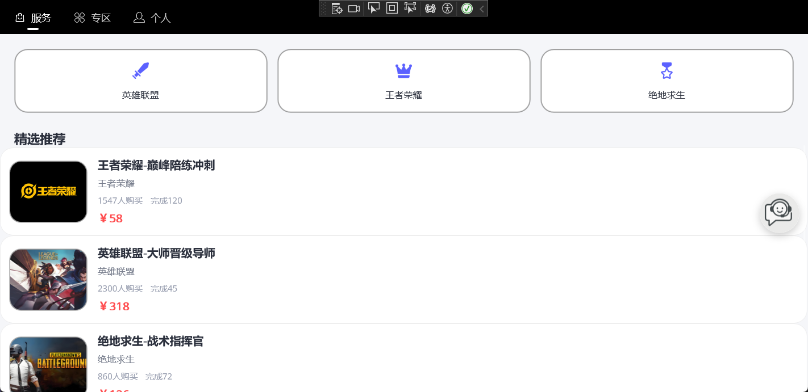 | 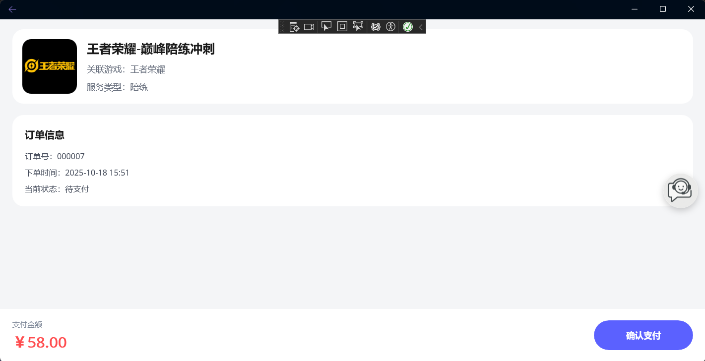 | 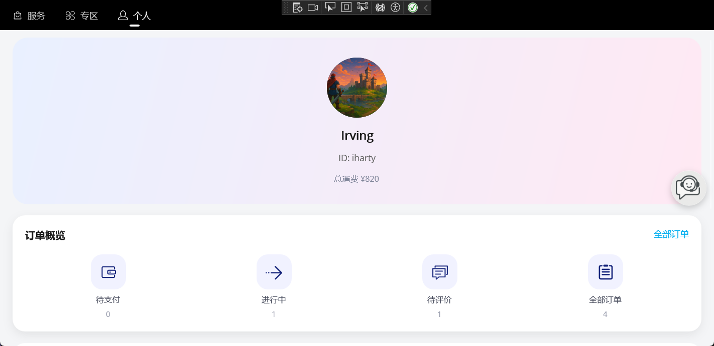 | 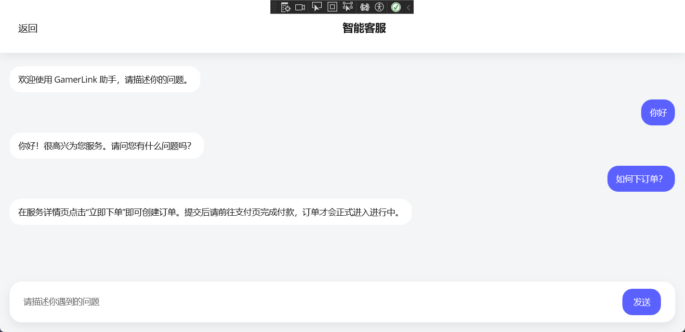 |

| Android Services | Android Order | Android Profile | Android Support |
| --- | --- | --- | --- |
| 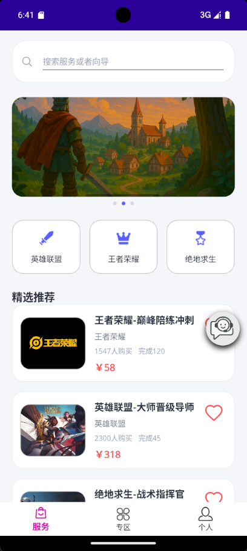 | 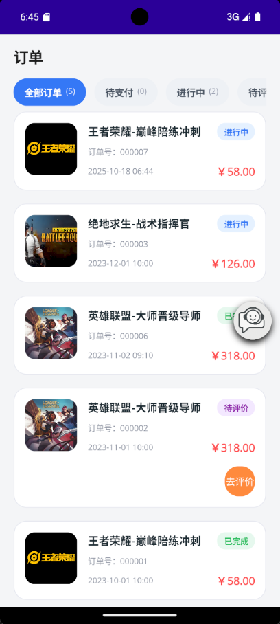 | 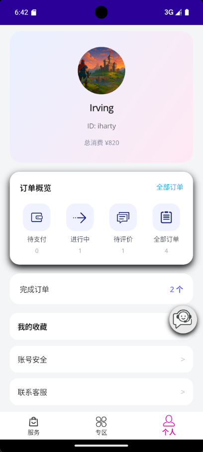 | 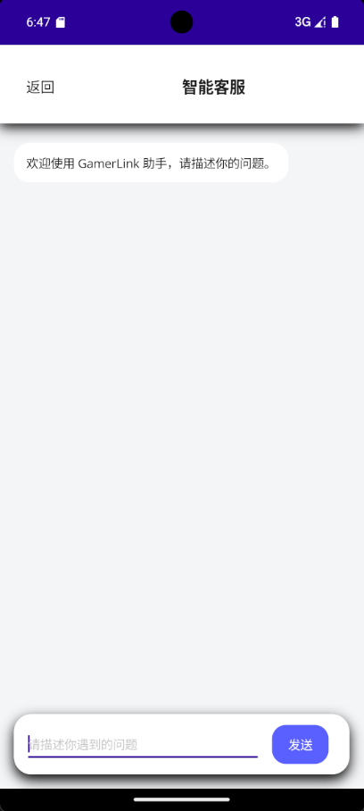 |

| Android Login | Android Register | Android Favorites | Android Review |
| --- | --- | --- | --- |
| 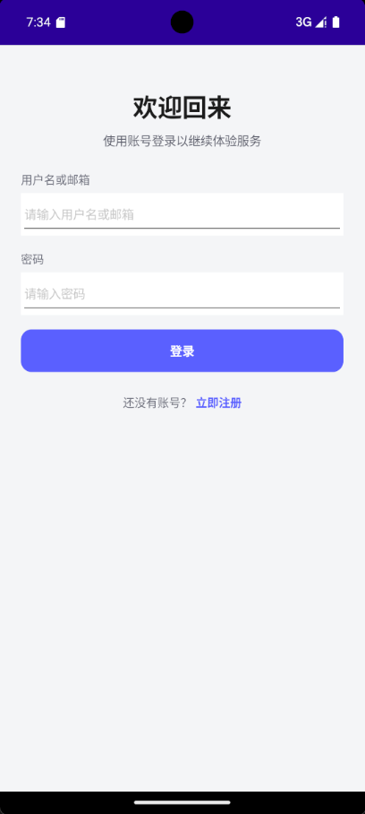 | 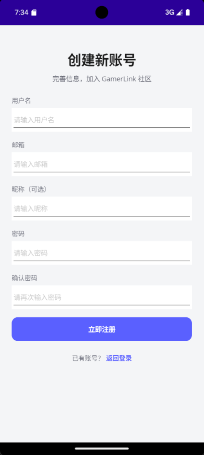 | 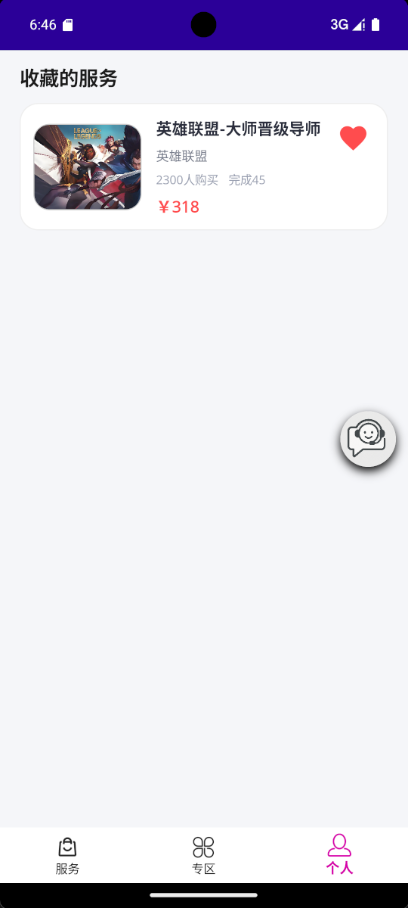 | 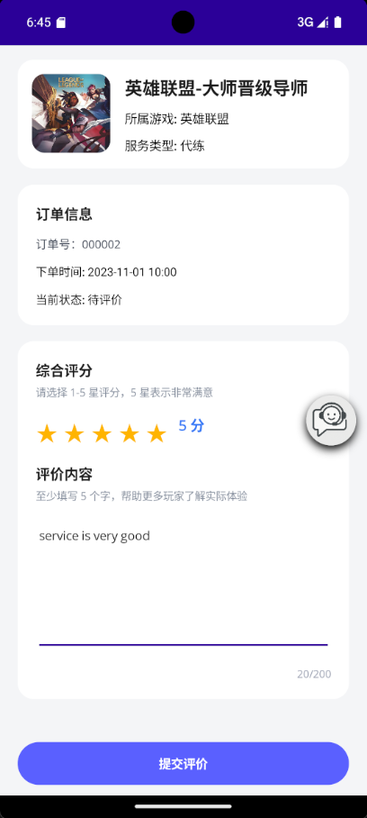 |

## Getting started
1. Install .NET 9 (preview) and the MAUI workloads:
   ```bash
   dotnet --info
   dotnet workload install maui
   ```
   - Android builds require API level 35. Run `dotnet build -t:InstallAndroidDependencies -f net9.0-android` or use Visual Studio's Android SDK Manager to install the platform.

2. Restore dependencies and compile:
   ```bash
   dotnet restore
   dotnet build -f net9.0-windows10.0.19041.0
   ```

3. Launch the app on your target device:
   ```bash
   # Windows desktop
   dotnet build -t:Run -f net9.0-windows10.0.19041.0

   # Android emulator or device
   dotnet build -t:Run -f net9.0-android
   ```
   On macOS, open the solution with Visual Studio 2022 17.9+ to target iOS or Mac Catalyst.

## Configuration
### Gemini RAG support
- Set the `GEMINI_API_KEY` environment variable (PowerShell example: `setx GEMINI_API_KEY "your-key"` and restart the terminal).
- Alternatively, drop a `gemini_api_key.txt` file inside the platform-specific `FileSystem.AppDataDirectory`; the file should contain only the API key.
- Update `Resources/Raw/knowledge_base.md` with your FAQs; the document is indexed at startup for semantic retrieval.

### Data and accounts
- The SQLite database lives under `FileSystem.AppDataDirectory`. In `DEBUG` builds it is deleted on startup (see `MauiProgram.cs`) so that seed content is always available.
- Seed data resides in `Resources/Raw/seed_data.json` and includes services, categories, banners, orders, and users.
- Default credentials:

  | Role | Username | Password | Notes |
  | --- | --- | --- | --- |
  | Player | `iharty` | `Password123!` | Sample history with paid orders and favorites |
  | Player | `proplayer` | `Password123!` | Heavy spender profile for analytics |
  | Admin | `root` | `root` | Unlocks the admin dashboard suite |

## Directory layout
```
GamerLinkApp/
|-- App.xaml / App.xaml.cs             # Application bootstrap and resources
|-- AppShell.xaml / AppShell.xaml.cs   # Shell navigation with dynamic tabs
|-- MauiProgram.cs                     # Dependency injection, EF Core, RAG bootstrap
|-- Behaviors/
|   |-- SupportFloatingButtonBehavior.cs
|-- Data/
|   |-- ServiceDbContext.cs
|-- Helpers/
|   |-- AuthNavigationHelper.cs
|   |-- ServiceHelper.cs
|-- Resources/
|   |-- Raw/
|       |-- seed_data.json
|       |-- knowledge_base.md
|-- Services/
|   |-- AuthService.cs
|   |-- IDataService.cs
|   |-- SqliteDataService.cs
|   |-- RagService.cs
|-- ViewModels/
|   |-- ServiceListViewModel.cs
|   |-- ZoneViewModel.cs
|   |-- ProfileViewModel.cs
|   |-- FavoriteServicesViewModel.cs
|   |-- OrderListViewModel.cs / OrderPaymentViewModel.cs / OrderReviewViewModel.cs
|   |-- Admin*.cs                       # Admin dashboard, orders, and users view models
|-- Views/
    |-- *.xaml / *.xaml.cs              # Frontend and admin pages
    |-- SupportChatPage.xaml(.cs)
```

## Module overview
- **Services/** - `SqliteDataService` handles EF Core access and seeding, `AuthService` owns session state, and `RagService` wraps Gemini-powered retrieval augmented generation.
- **ViewModels/** - MVVM command and state management for the shop, profile, favorites, order flow, and admin tooling using `ObservableCollection<T>` and async loading.
- **Views/** - Uses `CollectionView`, `Grid`, `Border`, gradients, and modal panels to build card-based layouts; admin pages include filters, validation, and media uploaders.
- **Behaviors/** - `SupportFloatingButtonBehavior` injects the support shortcut, manages drag-and-snap behaviour, and plays nicely with Shell navigation.
- **Helpers/** - `ServiceHelper` exposes the DI provider for page resolution while `AuthNavigationHelper` protects authenticated routes by surfacing the login flow.

## Where to take it next
- Replace the seed layer with a real backend by implementing a new `IDataService` and swapping the registration in `MauiProgram`.
- Expand the support knowledge base and explore incremental indexing or remote storage.
- Add real-time notifications (SignalR, push, or platform APIs) to broadcast order state changes.
- Introduce automated/unit/UI tests for the order wizard and admin pages to harden complex workflows.

> Tip: enable XAML Hot Reload during development for instant visual feedback. Comment out the debug database reset in `MauiProgram.cs` if you want the seed data to persist between sessions.

