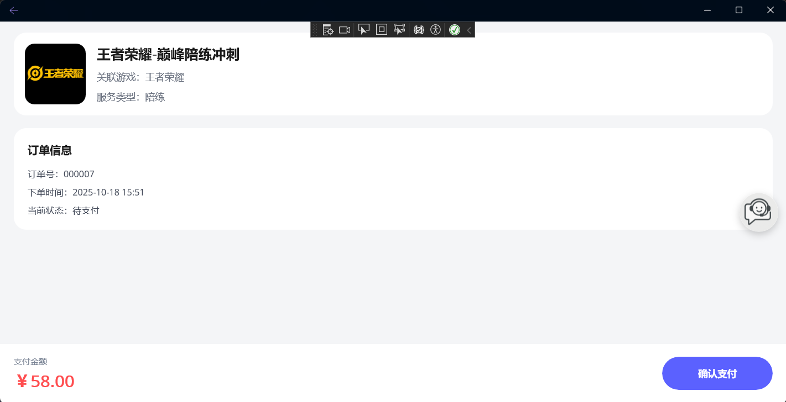
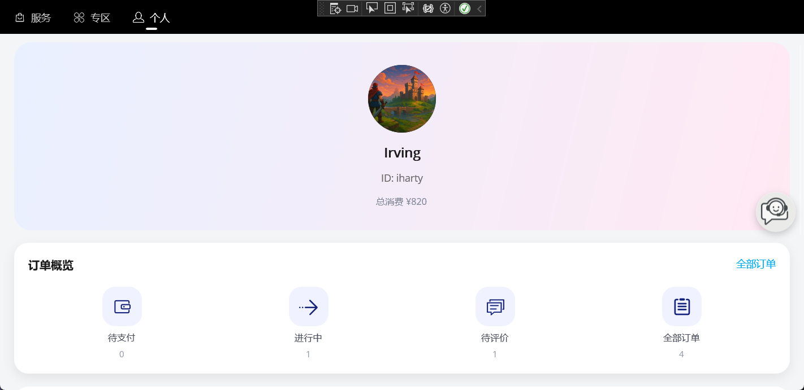
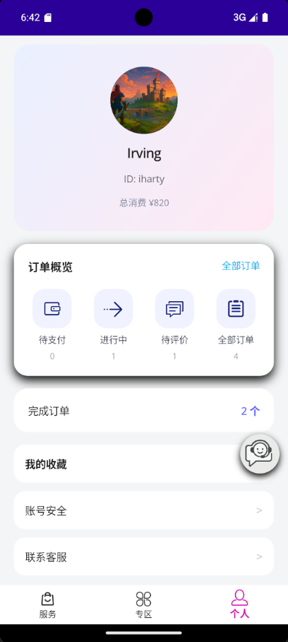
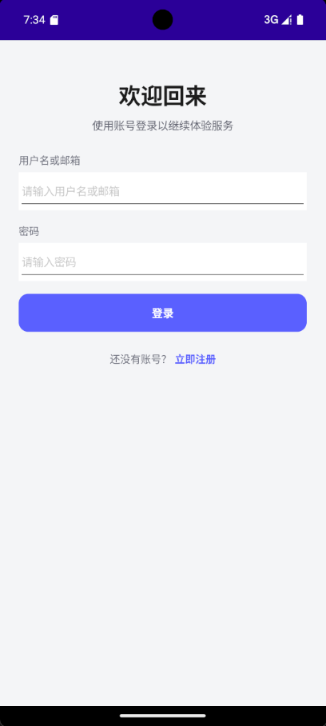
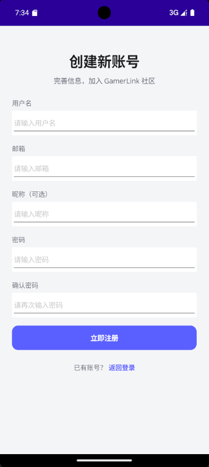
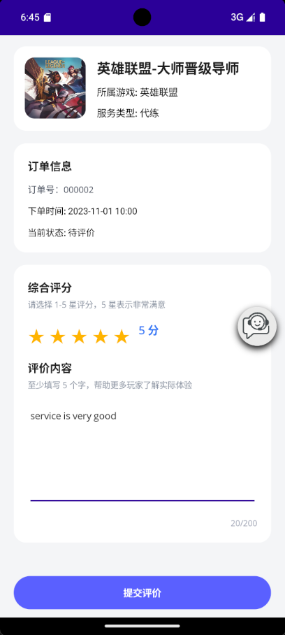

# GamerLinkApp - [English](README.md)

GamerLinkApp 是一个面向高品质游戏服务的 .NET MAUI 跨平台示例项目，内置种子数据、完整 MVVM 流程、AI 客服和管理员后台，方便你探索多端体验的实现方式。

## 功能亮点
- **服务发现**：轮播 Banner、分类筛选、标签高亮与详情深链，打造沉浸式服务卡片。
- **订单闭环**：覆盖下单、支付、评价的完整流程，并实时刷新个人中心的消费与订单统计。
- **个人中心**：聚合累计消费、状态计数、收藏入口以及历史订单快捷入口。
- **智能客服**：集成 Gemini RAG（需配置 `GEMINI_API_KEY`），通过可拖拽的悬浮按钮随时召唤帮助。
- **管理员后台**：服务、订单、用户看板支持筛选、批量操作、媒体管理和关键指标展示。
- **跨平台体验**：同一套代码运行在 Windows 与 Android，提供响应式布局、主题适配与触控优化。

## 界面预览
| Windows 服务列表 | Windows 支付 | Windows 个人中心 | Windows 客服 |
| --- | --- | --- | --- |
|  |  |  |  |

| Android 服务列表 | Android 订单 | Android 个人中心 | Android 客服 |
| --- | --- | --- | --- |
|  |  |  |  |

| Android 登录 | Android 注册 | Android 收藏 | Android 评论 |
| --- | --- | --- | --- |
|  |  |  |  |

## 快速开始
1. 安装 .NET 9（预览版）与 MAUI 工作负载：
   ```bash
   dotnet --info
   dotnet workload install maui
   ```
   - Android 目标需要 API Level 35，可运行 `dotnet build -t:InstallAndroidDependencies -f net9.0-android` 或使用 Visual Studio 的 SDK 管理器安装。

2. 还原依赖并编译：
   ```bash
   dotnet restore
   dotnet build -f net9.0-windows10.0.19041.0
   ```

3. 在目标设备上运行：
   ```bash
   # Windows 桌面
   dotnet build -t:Run -f net9.0-windows10.0.19041.0

   # Android 模拟器或真机
   dotnet build -t:Run -f net9.0-android
   ```
   在 macOS 上可使用 Visual Studio 2022 17.9+ 选择 iOS 或 Mac Catalyst 目标。

## 配置说明
### Gemini 智能客服
- 设置 `GEMINI_API_KEY` 环境变量（PowerShell 示例：`setx GEMINI_API_KEY "your-key"`，重新打开终端后生效）。
- 或在平台的 `FileSystem.AppDataDirectory` 中创建 `gemini_api_key.txt` 文件，内容仅保留密钥。
- 更新 `Resources/Raw/knowledge_base.md` 中的 FAQ，启动时会自动索引至语义检索存储。

### 数据与账号
- SQLite 数据库位于 `FileSystem.AppDataDirectory`；`DEBUG` 模式下会在启动时重建（参见 `MauiProgram.cs`）。
- 种子数据存放在 `Resources/Raw/seed_data.json`，包含服务、分类、横幅、订单和用户样例。
- 默认账号：

  | 角色 | 账号 | 密码 | 说明 |
  | --- | --- | --- | --- |
  | 普通玩家 | `iharty` | `Password123!` | 带有付费订单和收藏示例 |
  | 普通玩家 | `proplayer` | `Password123!` | 高消费用户画像 |
  | 管理员 | `root` | `root` | 可访问完整后台功能 |

## 目录结构
```
GamerLinkApp/
├─ App.xaml / App.xaml.cs             # 应用入口与资源
├─ AppShell.xaml / AppShell.xaml.cs   # Shell 导航与动态标签页
├─ MauiProgram.cs                     # 依赖注入、EF Core、RAG 初始化
├─ Behaviors/
│  └─ SupportFloatingButtonBehavior.cs
├─ Data/
│  └─ ServiceDbContext.cs
├─ Helpers/
│  ├─ AuthNavigationHelper.cs
│  └─ ServiceHelper.cs
├─ Resources/
│  └─ Raw/
│     ├─ seed_data.json
│     └─ knowledge_base.md
├─ Services/
│  ├─ AuthService.cs
│  ├─ IDataService.cs
│  ├─ SqliteDataService.cs
│  └─ RagService.cs
├─ ViewModels/
│  ├─ ServiceListViewModel.cs
│  ├─ ZoneViewModel.cs
│  ├─ ProfileViewModel.cs
│  ├─ FavoriteServicesViewModel.cs
│  ├─ OrderListViewModel.cs / OrderPaymentViewModel.cs / OrderReviewViewModel.cs
│  └─ Admin*.cs                       # 后台服务、订单、用户模块
└─ Views/
   ├─ *.xaml / *.xaml.cs              # 前台与后台页面
   └─ SupportChatPage.xaml(.cs)
```

## 模块概览
- **Services/**：`SqliteDataService` 处理 EF Core 访问与种子写入，`AuthService` 管理登录状态，`RagService` 封装 Gemini RAG 能力。
- **ViewModels/**：遵循 MVVM，使用 `ObservableCollection<T>` 和命令模式驱动服务列表、个人中心、收藏、订单与后台逻辑。
- **Views/**：运用 `CollectionView`、`Grid`、`Border`、渐变与模态面板构建现代化卡片界面，后台页面支持筛选、验证和媒体上传。
- **Behaviors/**：`SupportFloatingButtonBehavior` 为页面注入可拖拽的客服入口并与 Shell 导航兼容。
- **Helpers/**：`ServiceHelper` 暴露 DI 容器获取页面，`AuthNavigationHelper` 在未登录时引导用户进入登录流程。

## 可继续扩展
- 接入真实后端：实现新的 `IDataService` 并在 `MauiProgram` 中替换注册。
- 拓展客服知识库：丰富 Markdown FAQ 或引入增量索引 / 云端存储。
- 增加实时通知：结合 SignalR 或平台推送，将订单状态即时同步给用户。
- 补充自动化测试：为订单向导与后台页面编写单元 / UI 测试，提升复杂交互的稳定性。

> 小贴士：开发时可启用 XAML Hot Reload 快速预览界面；若想保留调试数据，请注释 `MauiProgram.cs` 中的调试数据库重置逻辑。
